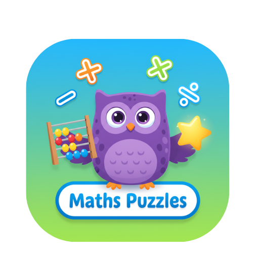

# 🎓 Maths Puzzles  
Application éducative pour enfants (6–12 ans) – Addition, Soustraction, Multiplication et Division



---

## 📌 À propos de l'application

**Maths Puzzles** est une application éducative conçue pour aider les enfants de **6 à 12 ans** à renforcer leurs compétences en mathématiques grâce à des exercices progressifs et interactifs.

L'application fonctionne **entièrement hors-ligne** et ne collecte **aucune donnée personnelle**, ce qui la rend parfaitement adaptée aux enfants.

---

## ✨ Fonctionnalités principales

- 🔢 Exercices : Addition, Soustraction, Multiplication, Division  
- 🎚 Trois niveaux de difficulté par âge  
- 👦👧 Adaptée aux enfants de 6 à 12 ans  
- 🎨 Interface colorée, simple et intuitive  
- 🌙 Thèmes visuels : clair, sombre, haute visibilité  
- 💾 Sauvegarde locale de la progression (scores & niveaux)  
- ⚙ Fonctionne 100% hors-ligne  
- 🚫 Sans publicité, sans trackers, sans achats intégrés  

---

## 🧠 Objectif pédagogique

L'application vise à :

- développer la logique mathématique  
- améliorer la vitesse de calcul mental  
- renforcer les notions scolaires par la pratique  
- offrir un outil d’apprentissage amusant et sûr  

---

## 🛠 Technologies utilisées

- **Python**  
- **BeeWare / Toga**  
- JSON pour la sauvegarde locale  
- Assets graphiques personnalisés  
- Compatibilité **Android** via Briefcase

---

## 📦 Installation (Développeur)

### 1️⃣ Cloner le projet

```bash
git clone https://github.com/yourname/mathspuzzles.git
cd mathspuzzles
